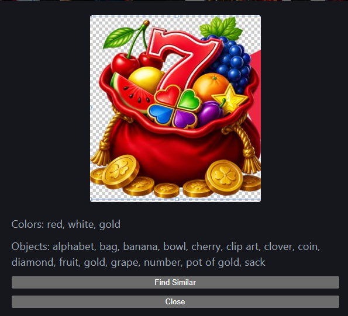
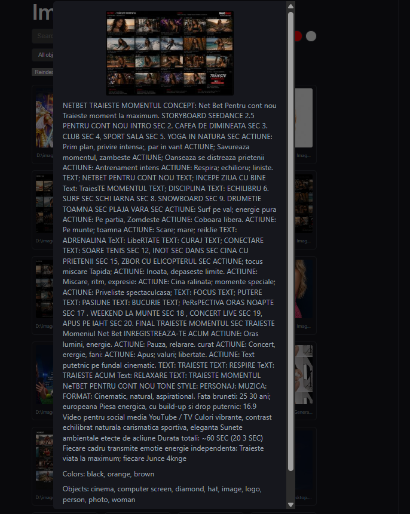

# ImageFind

Point ImageFind at a folder of images and it automatically figures out what's in
each one — so you can search your pictures the way you'd search the web, instead of
scrolling through folders looking for the one you remember.

## What it does

- **Recognizes what's in each image** — objects, scenes, people, animals,
  materials — automatically, with no manual labeling.
- **Reads any text written on the image** — logos, signs, banners, watermarks.
- **Notices the main colors** in each image, so you can filter by "red", "gold",
  "blue", and so on.
- **Finds images that look alike** — click a picture and it pulls up other images
  that visually resemble it.
- **Search box** — type a word and it finds every image where that word shows up,
  either as something the app recognized in the picture or as text printed on it.

## How it works

Run **Reindex** once (and again any time you add new pictures). The app looks at
every image and remembers what it recognized in it, any text written on it, its
main colors, and a "fingerprint" used later for "find similar." After that, search
is instant — new photos only need reindexing once, the rest stays cached.

## Tools used

| Tool | What it's for |
|---|---|
| RAM++ | Recognizes what's in each picture — objects, scenes, animals, materials |
| CLIP | Powers "find similar" and matching custom words/characters you add yourself |
| EasyOCR | Reads text printed on an image |
| K-means | Groups each image's pixels into a few dominant colors |

## Examples

Two real images from the app, with nothing typed in by hand — everything shown
below each one was figured out automatically just by looking at the picture.

> **Colors noticed:** red, white, gold
> **Things recognized:** a bag/pouch, coins, a clover, a diamond, fruit (banana,
> grape, cherry), gold, numbers, a "pot of gold" theme

Typing **"clover"** into search finds this image immediately, because the app
already recognized a clover in the picture on its own.

> **Colors noticed:** black, orange, brown
> **Things recognized:** a photo, a computer/cinema screen, a logo, a hat, a
> diamond, a person, a woman
> **Text read from the image:** an entire paragraph of ad-script copy, in
> Romanian — "NETBET TRAIESTE MOMENTUL CONCEPT: Net Bet Pentru cont nou...", read
> word for word even though it's dense, small, and spans the whole image

Typing **"netbet"** — or any other word from that paragraph — into search finds
this image immediately, because the app already read every word printed on it.
